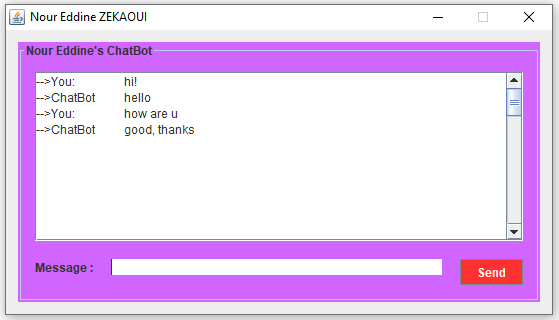

# Nour Eddine's Chatbot in JAVA
---
## Description

Nour Eddine's Chatbot is a Simple chatbot created in Java, it interact with users by responding to theire questions. This chatbot is equipped with a dialog interface which is easy to use. Users can write and send their messages in a very simple way by clicking on the send button or enter on the keyboard.

---
## Table of contents

 - [Overview ](#overview ) 
 - [Technologies](#technologies)
 - [How To Use](#how-to-use) 
 - [Author Info](#autor-info)
 
 ---
 ### Overview 
You remember the first chatbot Eliza, was created by MIT in the 1960s. Today if the conversational agents are booming. Yes, This is due to the many technological advances that have taken place in recent years. And this is the reason why I turned in my project, towards the realization of a chatbot that we will see its details later.

My chatbot is written in Java, is intended to answer questions that are asked on the dialog box based on a small database. My chatbot is simple, but adaptive, that is, we can link it to a specific domain, and so help us in this area.

 ---
 ### Technologies
  - Java
  - IDE : Eclipse
 ---
 ### How To Use
Download the source code for the project, then put it in the eclipse workspace folder, launch Eclipse and open the project called NourEddine's ChatBot (you can change the name if you want). Finally, click on the run icon to run the chatbot and you will be able to see the dialog box below :

 
 
 ---
If you have some tricky things to improve this simple chatbot then do it, don't forget to share with me, I will be grateful to you !
 ### Author Info
  - LinkedIn : [Nour Eddine ZEKAOUI](https://www.linkedin.com/in/nour-eddine-zekaoui-ba43b1177/)
--- 
#### Thank you for your intrest ☻
[Back To The Top](#description)
 

